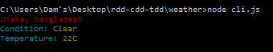
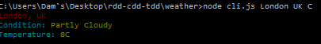

# Weather
> RDD, CDD and TDD workshop

- [Introduction](#introduction)
  - [What is the aim ?](#What is the aim)
  - [What you have to do before to start ?](#What you have to do before to start ?)
  - [How we can use it ](#How we can use it )

- [Licence](#licence)

## Introduction

 # What is the aim ?

	Give you the temperature and the climatic condition in any city you want 

# What you have to do before to start ? 

1. install node.js [node.js](https://nodejs.org/en/)
1. install node's modules : 
 npm install 'meow'
 npm install 'chalk'
 npm install 'update-notifier'
 npm install 'yql'
 npm install 'lodash'
 
 
#How we can use it ? 
node cli.js [City][Country][C/F]

#Example 

## Licence

[Uncopyrighted](http://zenhabits.net/uncopyright/)
